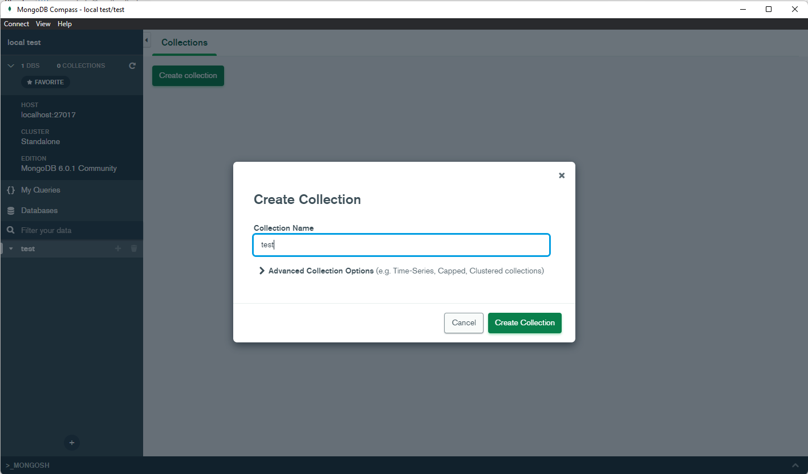

# MongoDB

::: info
Halaman MongoDB ini tidak akan membahas mengenai instalasi serta pembuatan pengguna. Silahkan hubungi administrator.
:::

## Collection

_Collection_ merupakan kumpulan data yang berisi BSON _document_. _Collection_ ini sama seperti _table_ dalam _database_ SQL.

### Membuat Collection

Buka MongoDB Compass, masukkan _connection string_ dengan format **mongodb://[username]:[password]@[host]:[port]/[database]** lalu buka _database_, dan klik tombol **Create Collection**.

