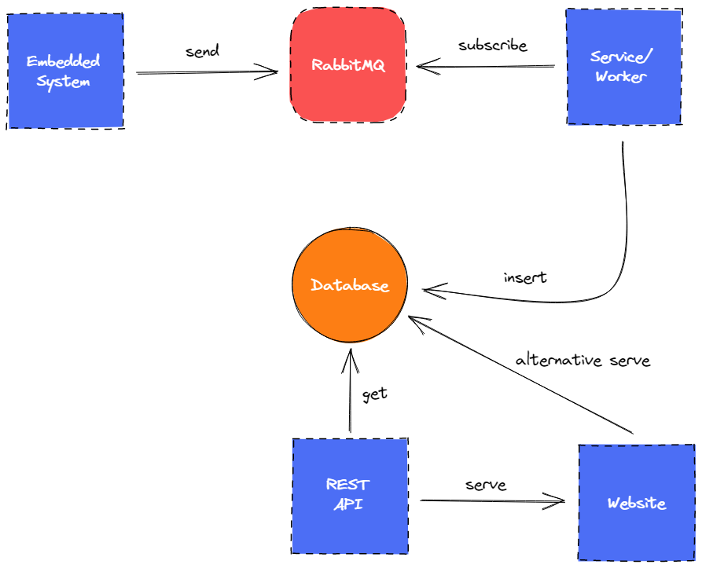

# Prasyarat

Terdapat beberapa hal yang perlu dipenuhi termasuk _software_ yang di-_install_ dan alur yang dipahami secara komprehensif untuk dapat mengikuti panduan secara keseluruhan.

## Software

- [RabbitMQ](https://rabbitmq.com/) (_install_ secara lokal maupun di _server_)
- [MongoDB](https://www.mongodb.com/) (_install_ secara lokal maupun di _server_)
- [NodeJS](https://nodejs.org/)
- IDE (disarankan untuk menggunakan [Visual Studio Code](https://code.visualstudio.com/))

## Alur

Berikut merupakan alur dari sistem yang akan dibangun:

**Embedded System** akan mengirimkan pesan yang didapat dari sensor ke **RabbitMQ** melalui protokol MQTT. Setelah pesan dikirimkan, **Service** atau **Worker** yang dibangun dengan NodeJS akan mengambil (_subscribe_) pesan tersebut dan mengolahnya sesuai kebutuhan sebelum nantinya dimasukkan ke dalam _database_, yaitu **MongoDB**. Data yang masuk ke _database_ diambil dan "disajikan" melalui **REST API** yang selanjutnya di-_consume_ oleh **Website** (_client-side_), atau sebagai alternatif bisa juga langsung ditampilkan di **Website** tanpa perlu **REST API** (_server-side_).

## Pertanyaan Umum

### Embedded system

#### Apa itu embedded system?

Embedded system merupakan sebuah device yang letaknya paling ujung yang bertugas untuk mengirimkan data dari sensor ataupun dari input peripheral lain. Device yang umum dipakai adalah Arduino, NodeMCU, atau Raspberry Pi.

### RabbitMQ

#### Apa itu RabbitMQ?

RabbitMQ merupakan sebuah message broker dengan dukungan protokol AMQP, MQTT, dan STOMP yang bertugas untuk menerima pesan dan mengirimkannya kembali.

#### Mengapa RabbitMQ?

Dengan dukungan multi-protokol, RabbitMQ mampu menjembatani protokol sederhana, yaitu MQTT, yang digunakan di embedded system dimana hanya memiliki sumber daya yang terbatas dengan protokol yang lebih kompleks, yaitu AMQP, yang digunakan di service atau worker. Selain itu RabbitMQ juga mendukung routing system dengan partisi-partisi yang dapat didefinisikan sendiri dan lebih rumit dari MQTT biasa, mendukung sistem autentikasi untuk memisahkan setiap pengguna, serta management website untuk melihat informasi dari pesan yang masuk ke dalam sistem.

::: tip
Dalam website-nya, RabbitMQ memiliki banyak hands-on tutorial yang meliputi beberapa bahasa pemrograman populer dan dokumentasi yang sangat baik.
:::

### Service

#### Mengapa NodeJS

Pengembangan service dapat dilakukan di bahasa pemrograman dan runtime manapun selama mendukung komunikasi dengan AMQP. Hanya saja dalam buku panduan ini digunakan NodeJS agar lebih cepat dalam prototyping.
