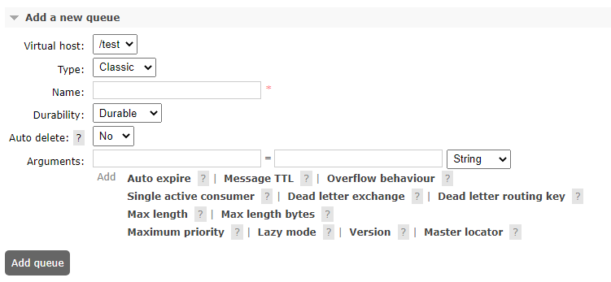
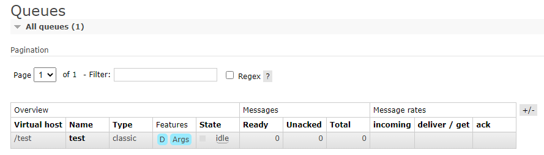
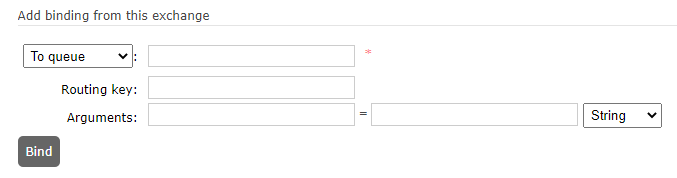
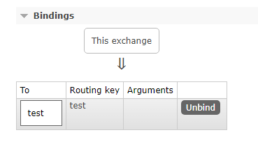

# RabbitMQ

::: info
Halaman RabbitMQ ini tidak akan membahas mengenai instalasi serta pembuatan pengguna. Silahkan hubungi administrator.
:::

## Queue

_Queue_ merupakan "kotak masuk" yang nantinya semua pesan akan berakhir di sana dan di-subscribe oleh _service_ / _worker_.

### Membuat Queue

Untuk membuat _queue_, silahkan login ke _management website_ RabbitMQ dan buka _tab queue_, di bagian **Add a new queue**, pilih **Virtual host** sesuai yang dibuatkan oleh administrator, Name diisi dengan **test**, dan sisa form lainnya dibiarkan sesuai default lalu klik tombol **Add queue**.

Setelah tombol diklik akan muncul _queue_ yang dibuat sebelumnya.

## Exchange

Jika _queue_ diibaratkan sebagai kotak masuk, maka _exchange_ adalah kantor pos yang bertugas untuk menyortir kemana pesan akan diteruskan. Karena dari _embedded system_ akan dikirimkan melalui protokol MQTT dan service akan _subscribe_ melalui protokol AMQP, maka perlu dijembatani terlebih dahulu.

### Membuat Routing Key

Untuk membuat _routing key_, klik tab **Exchanges** lalu pilih _exchange_ **amq.topic**.

Di bagian **Add binding**, pilih _dropdown_ dengan **To queue**, lalu isi nama isi _queue_ yang sudah dibuat sebelumnya yaitu **test**. Pada form **Routing key**, isi juga **test**. _Routing key_ inilah yang nanti digunakan sebagai [_topic_](https://www.hivemq.com/blog/mqtt-essentials-part-5-mqtt-topics-best-practices) di MQTT.

Setelah tombol diklik akan muncul _binding_ yang dibuat sebelumnya.

