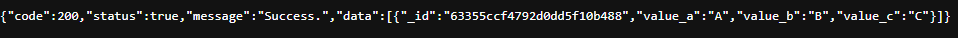
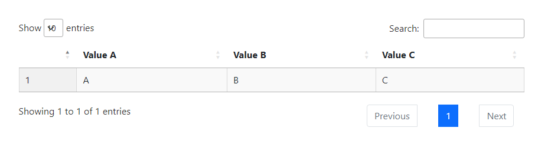

# REST API & Website

REST API dan _website_ merupakan dua cara untuk menampilkan data dari database. Bisa menggunakan keduanya maupun hanya _website_ saja meskipun di buku panduan ini yang akan digunakan adalah keduanya.

## Clone Source Code

_Clone_ atau _download template source code_ REST API di [https://github.com/pr0ph0z/iot-service](https://github.com/pr0ph0z/iot-service) dan _template source code website_ di [https://github.com/pr0ph0z/iot-website](https://github.com/pr0ph0z/iot-website), masuk ke dalam folder yang sudah di-_clone_, lalu buka masing-masing IDE dengan _path_ foldernya.

## REST API

REST API merupakan salah satu cara untuk menampilkan data dari _database_. Tujuan dibuat REST API adalah untuk _decoupling_ atau pemisahan antara _view_ atau _website_ itu sendiri dengan proses pengambilan data dari _database_. REST API pada buku panduan ini dibuat dengan Express.js.

### Struktur Project

```
.
├── .env.example
├── index.js
└── src/
    ├── config/
    │   └── index.js
    ├── controllers/
    │   └── test.js
    ├── databases/
    │   └── mongo.js
    ├── models/
    │   └── test.js
    ├── routes/
    │   ├── test.js
    │   └── index.js
    ├── services/
    │   └── test.js
    └── app.js
```

- **.env.example** berfungsi untuk menyimpan _key_ yang diperlukan untuk disimpan di file **.env**
- **index.js** berfungsi untuk menjalankan _web server_
- **app.js** berfungsi untuk melakukan proses inisiasi koneksi ke _database_ dan melakukan konfigurasi terhadap _web server_
- **config/index.js** berfungsi untuk menyimpan _config variable_, berisi _config_ yang di-_load_ dari file **.env**
- **controllers** folder yang bertujuan untuk menyimpan semua file saat request diterima dan meneruskan tersebut ke fungsi-fungsi yang berada di folder `services`
- **databases** folder yang bertujuan untuk menyimpan fungsi inisiasi koneksi ke _database_
- **models** folder yang bertujuan untuk menyimpan model dari skema database yang dibutuhkan
- **routes** folder yang bertujuan untuk menyimpan semua daftar routes yang tersedia yang nantinya dipanggil di `app.js`
- **services** folder yang bertujuan untuk menyimpan semua _business logic_

## Edit Environment File

Buka file **.env.example**, _copy_ isinya, buat file baru dengan nama **.env**, lalu paste isi dari **.env.example** dan isi sesuai nilai yang dibutuhkan.

<Tabs>
<Tab name=".env.example" text=".env.example" :max-height="450">

```
MONGO_URL=
PORT=
```

</Tab>
<Tab name=".env" text=".env" :max-height="450">

```
MONGO_URL=mongodb://test:testlocalhost:27017/test
PORT=5001
```

</Tab>
</Tabs>

## Install Dependencies

_Install dependencies_ yang dibutuhkan dengan perintah `npm install`.

## Jalankan REST API

Jalankan REST API dengan perintah `node index.js`.

## Cek Hasil

Buka `http://localhost:5001/test` di _browser_ dan lihat hasilnya. Jika sama seperti gambar di bawah ini (`_id` akan berbeda) artinya REST API berhasil dijalankan.



## Apa yang Terjadi?

Kira-kira begini alur antar file yang terjadi"

```
index.js
   |
   |
   |
   v
 app.js
   |\
   | \
   |  databases/mongo.js
   v
routes/index.js
   |
   |
   |
   v
routes/test.js
   |
   |
   |
   v
controllers/test.js ---> response
   |      ^
   |      |
   |      |
   v      |
services/test.js
```

`index.js` akan menjalankan _web server_ dengan konfigurasi yang didapat dari `app.js`, lalu dengan waktu yang sama `app.js` juga melakukan inisiasi koneksi ke `databases/mongo.js`. Ketika ada _request_ masuk, `app.js` akan meneruskan _request_ tersebut ke `routes/index.js` dan mencari _pattern route_ mana yang cocok dengan yang sudah didaftarkan, yaitu `routes/test.js`. Setelah mendapatkan _pattern route_ yang cocok, maka _request_ akan diteruskan ke `controllers/test.js`, _controller_ selanjutnya memanggil fungsi ke `services/test.js` dan setelah didapatkan nilai kembaliannya, _controller_ pun akan mengembalikan _response_ ke _client_ yang melakukan _request_.

## Website

Jika dilihat di dalam struktur _project_-nya, website hanya memiliki satu file yaitu index.html.

<Tabs>
<Tab name="index.js" text="index.html" :max-height="450">

```html{16-37}
<html lang="en">
  <body>
    <table id="example" class="display cell-border" style="width: 100%">
      <thead>
        <tr>
          <th></th>
          <th>Value A</th>
          <th>Value B</th>
          <th>Value C</th>
        </tr>
      </thead>
      <tbody></tbody>
    </table>
    <script>
      $(document).ready(function () {
        $("#example").DataTable({
          ajax: "http://localhost:5001/test",
          columns: [
            {
              render: function (data, type, row, meta) {
                return meta.row + meta.settings._iDisplayStart + 1;
              },
            },
            {
              data: "value_a",
            },
            {
              data: "value_b",
            },
            {
              data: "value_c",
            },
          ],
          render: function (data, type, row, meta) {
            return meta.row + meta.settings._iDisplayStart + 1;
          },
        });
      });
    </script>
  </body>
</html>
```

</Tab>
</Tabs>

Tujuan _website_ pada buku panduan ini pun sederhana, hanya menampilkan data dengan bentuk tabel. Data tersebut didapat dari REST API yang sudah dibuat sebelumnya. Poinnya adalah pada sintaks `ajax: "http://localhost:5001/test"`, DataTable akan melakukan _request_ ke REST API dan melakukan penyesuaian kolom pada properti `columns`. Lalu jika file `index.html` tersebut dibuka dan menampilkan tabel seperti di bawah ini maka website sudah berjalan dengan baik.


